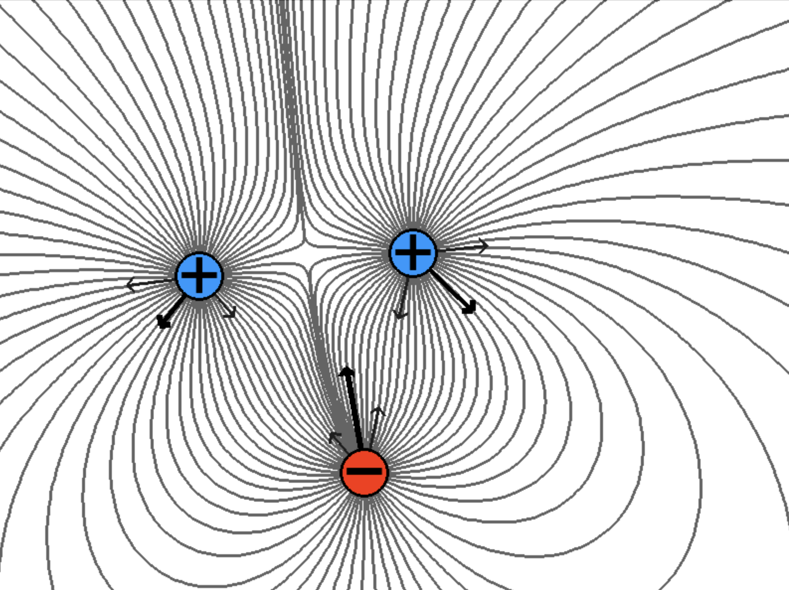

# Electric Dipole Simulation



## Description
- Accurately simulates the electric field strength and visualizes real time.

## Dependencies
(You might have to uninstall pygame if it is already installed)

```pip install pygame-ce library```

## How to Run
- Run main.py

## Controls
- Drag particles around to move them.

## Extra
- Add more particles to particles list in main.py for more fun.
